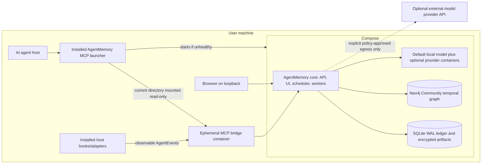

# AgentMemory Product Requirements Document

| Field | Value |
|---|---|
| Product | AgentMemory |
| Document status | Complete production specification |
| Scope | Complete production product |
| Updated | 2026-07-13 |
| Normative technical specification | [TECHNICAL_REQUIREMENTS.md](TECHNICAL_REQUIREMENTS.md) |

## 1. Product definition

AgentMemory is an agent-neutral, persistent, evidence-backed memory and code intelligence platform. It gives AI agents durable continuity across sessions, projects, repositories, and agent hosts on the user's machine while preserving provenance, privacy, temporal validity, and user control. A signed export or backup can move that Brain to another user-owned machine without introducing a hosted AgentMemory service.

AgentMemory is not a Codex, Claude, Gemini, GLM, or IDE-specific plugin. It is a standalone brain service. Each supported agent receives a thin adapter that maps the host's lifecycle into AgentMemory's canonical event and context interfaces.

This document defines the complete product. There is no reduced MVP product. Engineering work may be sequenced internally, but a partial implementation is not considered a releasable AgentMemory product.

### 1.1 Product vision

Any authorized agent should be able to answer:

- What happened in previous sessions, regardless of which agent performed the work?
- Why was a decision made, and what evidence supports it?
- Where is a concept implemented in the current codebase?
- Which frontend, service, package, or repository consumes a given API?
- What changed, what remains unresolved, and what knowledge has become stale?
- How are separate projects connected inside the user's wider technical system?

Answers must be concise, temporally correct, scoped to the caller's permissions, and traceable to sessions, commits, files, symbols, commands, tests, documents, or explicit user statements.

### 1.2 Goals

- Provide automatic cross-session continuity for all certified agent hosts.
- Share authorized memory across agents instead of partitioning it by vendor.
- Model every project as a connected subgraph within a larger Brain.
- Maintain an incremental, commit-aware code and architecture graph.
- Support cross-project dependency and service-topology reasoning.
- Combine exact, lexical, semantic, temporal, and graph retrieval.
- Make every factual memory explainable through provenance and evidence.
- Learn from verified outcomes by creating evidence-backed, scoped, reversible lessons and procedures.
- Run the complete AgentMemory product locally through Docker Compose; no AgentMemory service, database, control plane, or telemetry backend is hosted by the project.
- Make installation feel like installing one MCP even to a user who has never used Docker: the installer detects, securely provisions, configures, starts, and validates the required local container runtime before configuring AgentMemory, and later agent sessions start the stack automatically.
- Ship a fully functional offline default provider set so semantic indexing, reranking, memory extraction, and learning work immediately without an API key or model download at runtime.
- Give users full inspection, correction, export, retention, and deletion controls.
- Remain independent of any embedding, reranking, extraction, or agent provider.

### 1.3 Non-goals

- AgentMemory does not replace an agent's short-term context window.
- AgentMemory does not store hidden chain-of-thought or private model reasoning.
- AgentMemory does not treat unsupported LLM-generated statements as facts.
- AgentMemory does not execute unrelated autonomous actions on the user's behalf.
- AgentMemory does not use a directory path as the durable identity of a project.
- AgentMemory does not make vectors the canonical copy of source content.
- AgentMemory does not provide a SaaS, remotely hosted Brain, shared cloud control plane, or Kubernetes deployment.
- AgentMemory does not require the user to preinstall or understand Docker, Compose, Python, Node.js, Java, Neo4j, or a model runtime. On a supported machine, initiating the MCP installation is the only product setup action. The installer may request unavoidable native operating-system approval for OS virtualization features, third-party license acceptance, or reboot, but it must perform and resume every technical step itself. Firmware-disabled virtualization or device policy that software cannot change is a plainly explained unsupported/administrator-blocked state, never a Docker troubleshooting task for the user.
- Local-only deployment does not prohibit a user from explicitly configuring an external embedding or reranking API. Such egress is optional, policy-controlled, visible, and disabled by default; extraction remains local.

### 1.4 Primary users

- Nontechnical agent users who expect MCP installation to produce a working product without terminal commands or Docker knowledge.
- Individual developers working across multiple repositories and agents.
- Developers moving a signed Brain export or backup between machines they control.
- Local installation owners managing privacy, providers, Brain boundaries, and resources.
- Agent-adapter authors adding new hosts.
- Embedding and reranking adapter authors adding new providers.

## 2. Product principles

1. **Agent-neutral core:** Host-specific code ends at the adapter boundary.
2. **Evidence before assertion:** A factual relationship must have resolvable evidence or be labeled as an inference.
3. **One connected Brain:** Projects are scoped subgraphs, not isolated per-directory databases.
4. **Path is location, not identity:** Repositories, projects, and checkouts have distinct stable identities.
5. **Local-only product:** The Brain, canonical ledger, graph, indexes, UI, workers, audit data, and backups run on and remain on the user's machine; optional provider calls are explicit egress, not hosted AgentMemory infrastructure.
6. **Asynchronous capture:** Agent hooks enqueue quickly and never perform expensive indexing inline.
7. **Canonical data is rebuildable:** Raw authorized events and source content produce replaceable graph and vector projections.
8. **Temporal truth:** Old facts remain historically queryable but are not silently presented as current.
9. **Progressive disclosure:** Context expands from compact briefing to detailed evidence only when useful.
10. **Provider independence:** Provider-specific semantics live only inside versioned adapters.
11. **Graceful degradation:** Provider or graph failures must not block the user's coding agent.
12. **User control:** Memories can be inspected, corrected, pinned, scoped, exported, and forgotten.
13. **Evidence-gated improvement:** Observed failures may propose learning, but only independent validation and policy may promote it.
14. **No autonomous self-modification:** Learned artifacts cannot rewrite model weights, system prompts, permissions, policies, adapters, or executable code.
15. **Zero-knowledge setup:** Installation and recovery communicate in plain language and automate container-runtime acquisition, configuration, startup, and validation; a user is never instructed to diagnose Docker or run a Compose command.

## 3. System architecture



### 3.1 Required components

- Local AgentMemory core container providing the Brain daemon, API, UI, scheduler, and bounded worker roles.
- Durable raw-event ledger, outbox, dead-letter handling, and replay.
- Local Neo4j Community container providing the temporal and evidence graph.
- Full-text and vector indexes.
- Incremental code, API-contract, dependency, and infrastructure indexers.
- Memory extraction, consolidation, contradiction, and invalidation workers.
- Hybrid retrieval, rank fusion, graph expansion, and optional reranking.
- MCP server, service API, SDKs, CLI, and management UI.
- Agent adapter SDK and certified first-party adapters.
- Embedding and reranking provider SDK and certified built-in adapters.
- Signed multi-architecture OCI images, a Docker Compose application, a full signed native zero-knowledge bootstrapper for macOS, Linux, and Windows, and a minimal steady-state MCP launcher after installation.
- A cross-platform container-runtime provisioner that can securely acquire and install the certified Docker Engine/Desktop and Compose release when no compatible local runtime exists.
- An ephemeral per-agent-session MCP bridge that receives only a read-only bind mount of the current project directory.
- Audit, metrics, traces, diagnostics, backup, restore, and migration systems.
- Local named volumes and user-selected encrypted backup archives; no hosted storage dependency.

### 3.2 Canonical ownership

- Raw authorized events and artifacts are canonical records.
- Source repositories and documents remain canonical for their content.
- Memories, assertions, code entities, full-text documents, and vectors are derived projections.
- All projections must be reproducible from canonical inputs, parser/extractor versions, and configuration.
- Neo4j stores graph entities, temporal assertions, evidence metadata, searchable text, vector records, hashes, and artifact references; large raw payloads belong in encrypted blob storage.

## 4. Agent integration platform

### 4.1 Canonical AgentEvent contract

Every adapter must emit a versioned, idempotent event containing:

- Globally unique event ID and schema version.
- Event type, occurrence time, and ingestion time.
- Brain, local principal, project, repository, checkout, branch, and commit scope when known.
- Agent host, adapter, model, session, turn, task, and subagent provenance.
- Causation, correlation, and ordering identifiers.
- Sanitized payload or encrypted payload reference.
- Sensitivity classification and applicable retention policy.

Required canonical event families include:

- `session.started` and `session.completed`
- `prompt.received`
- `turn.started` and `turn.completed`
- `task.started`, `task.checkpointed`, and `task.completed`
- `tool.started`, `tool.completed`, and `tool.failed`
- `file.read`, `file.changed`, `file.deleted`, and `file.renamed`
- `command.completed` and `test.completed`
- `git.commit.observed` and checkout/branch changes
- `context.injected` and memory feedback/correction events
- `attempt.started`, `attempt.completed`, and `outcome.observed`
- `artifact.reverted`, `incident.recorded`, and `feedback.recorded`
- `learning.candidate_created`, `learning.reviewed`, and `evaluation.completed`
- `procedure.injected`, `procedure.applied`, `procedure.validation_completed`, and `procedure.rolled_back`

### 4.2 Adapter requirements

- Agent adapters may use lifecycle hooks, extensions, SDK callbacks, transcript streams, wrappers, or approved host APIs.
- MCP is the model-facing tool and resource interface; it is not the lifecycle-capture engine.
- Certified adapters must declare which lifecycle capabilities the host exposes.
- Missing events must be represented explicitly rather than fabricated.
- Hosts without lifecycle hooks must be supported through a shell/process wrapper, transcript importer, filesystem/Git observation, and explicit checkpoint tools.
- Originating agent and model remain provenance fields and must not automatically silo memory retrieval.
- Hooks must durably enqueue and return within their configured deadline.
- Adapter failure must not prevent the host agent from continuing.
- Offline buffering, reconnection, retry, deduplication, and clock-skew handling are mandatory.
- A public conformance suite must validate schema, ordering, cancellation, failure, redaction, and context-injection behavior.
- Any MCP-capable host without a separately certified configuration adapter must be supported through the path-neutral `agentmemory.custom-agent-registration.v1` contract. The host or its plugin/marketplace installer owns its registration and invokes the absolute signed launcher with exactly `mcp --agent custom`; AgentMemory must verify the signed-launcher MCP handshake without discovering, reading, writing, backing up, or deleting an undocumented host configuration.

### 4.3 Certified adapter coverage

The production product must ship adapters for the major supported coding-agent hosts, including Claude Code, Codex, Gemini CLI, Cursor-compatible environments, and the path-neutral custom-host integration. GLM and other model families inherit the adapter of the host through which they operate. New hosts must be addable without modifying memory, graph, provider, retrieval, or installer orchestration code.

## 5. Brain, project, and repository identity

### 5.1 Scope model

- A `Brain` is a logical security and trust boundary inside the one local Neo4j Community instance.
- Projects inside one Brain share a connected graph.
- Personal, company, and other incompatible trust domains must use separate local Brains unless the installation owner explicitly transfers selected data through the governed import workflow.
- Every graph entity and relationship must be Brain-scoped, and authorization must be enforced before search and before every graph expansion.

### 5.2 Identity model

- `Project` represents a logical product or work scope.
- `Repository` represents source history.
- `Checkout` represents a local clone, directory, or Git worktree.
- `Component` and `Service` represent deployable or logical units, including multiple services in a monorepo.
- A path is a mutable checkout alias and default retrieval hint, never a durable project ID.

Project resolution order is:

1. Explicit project manifest and UUID.
2. Known repository identity and configured project mapping.
3. Known checkout alias.
4. Canonical real-path fallback for non-versioned directories.

The resolver must correctly handle moved directories, symlinks, clones, forks, remotes, submodules, nested repositories, monorepos, worktrees, non-Git projects, and unrelated directories with identical names.

### 5.3 Retrieval scopes

- `current`: current project, repository, checkout, branch, and working tree.
- `related`: current scope plus authorized projects connected by graph evidence.
- `selected`: explicit caller-provided project set.
- `global`: all authorized projects in the Brain.

Current scope provides a ranking boost, not a hard boundary, unless policy requires strict isolation.

## 6. Durable ingestion and processing

- Acknowledged events must survive daemon, worker, and machine restarts.
- Delivery may be at-least-once; effective graph and memory writes must be idempotent.
- Events must record occurrence and ingestion timestamps.
- Processing must support ordering keys, backpressure, replay, checkpoints, watermarks, dead-letter queues, and safe repair.
- Event schema upgrades must be backward compatible or include deterministic migrations.
- Raw event replay must not blindly repeat stateful, nondeterministic LLM reductions; derived operations require stable idempotency keys and recorded extractor versions.
- Neo4j or provider outages must leave work durably queued.
- Queue capacity and disk-pressure policies must be visible and configurable.
- Secret scanning, private-block removal, ignore rules, and egress classification happen before persistence or remote provider invocation.

## 7. Memory system

### 7.1 Memory classes

- Episodic: work performed during a session or task.
- Semantic: stable domain, architecture, and system knowledge.
- Procedural: repeatable commands, workflows, and operational practices.
- Preference: explicit user or local Brain-owner choices.
- Decision: a choice, alternatives, rationale, and consequences.
- Constraint: technical, policy, product, or environmental limitations.
- Failure and lesson: unsuccessful approaches and learned corrections.
- Unresolved work: blockers, questions, risks, and next actions.

Raw tool events are not automatically long-term memories. Consolidation promotes only useful information and retains evidence links.

### 7.2 Memory lifecycle

The system must support extraction, consolidation, deduplication, merging, pinning, correction, confidence changes, supersession, contradiction, expiry, archival, and deletion.

Each memory must contain:

- Stable identity, type, content, and structured attributes.
- Brain/project/access scope.
- Creation, observation, validity, and last-used timestamps.
- Importance, confidence, and status.
- Agent, user, extractor, and model provenance.
- Evidence and source-event links.
- Content and extraction hashes.
- Retention, expiry, and deletion state.

Explicit user corrections outrank inferred memories but do not erase history unless the user requests deletion.

## 8. Evidence-gated self-improvement and learning

### 8.1 Definition and safety boundary

Self-improvement means governed updates to evidence-backed memories, lessons, retrieval behavior, and versioned procedures. It does not mean that an agent may autonomously modify model weights, system/developer prompts, tool permissions, approval rules, privacy or egress policy, provider configuration, agent adapters, security controls, or executable repository/system code.

The learning subsystem may recommend changes to those controlled surfaces, but implementation must follow the normal authorization, review, testing, and release workflow.

The production learning cycle is:

```text
define expected outcome
-> observe attempt and independent outcome
-> detect a possible mistake
-> create evidence-backed causal hypotheses
-> derive a scoped lesson and procedure candidate
-> replay and evaluate against baseline and counterexamples
-> apply promotion policy
-> inject into matching future work
-> measure independent outcomes
-> strengthen, narrow, dispute, stale, suspend, or roll back
```

### 8.2 Task contracts and observable outcomes

Before judging success or failure, the system must create or obtain a `TaskContract` containing:

- Goal and expected outcome.
- Acceptance criteria.
- Required tests, checks, or external verification.
- Allowed scope and constraints.
- Relevant Brain, project, repository, branch, commit, environment, and agent-host context.
- Risk class and any required approvals.

When an explicit contract is unavailable, the system may create a candidate contract from the user request and surrounding context, but inferred acceptance criteria must remain labeled as inferred.

An `Attempt` records actions performed toward a task. An `Outcome` records observable results and links to independent evidence such as authenticated user feedback, compiler diagnostics, test/CI results, command exit codes, observability signals, repository state, review findings, reversions, deployments, or incidents.

The following may signal a learning candidate:

- Explicit user correction, rejection, or confirmation.
- Failed tests, builds, compilers, linters, contracts, or security checks.
- Tool, protocol, or schema errors.
- A failed attempt followed by a materially different independently verified repair.
- Reverted code, rolled-back deployment, reopened work, or incident evidence.
- Repetition of an already documented failure pattern.
- Violation of an active decision, constraint, or approved procedure.
- Another agent correcting an earlier agent's result.
- Feedback marking a memory or procedure harmful, incorrect, stale, or inapplicable.

A failure signal alone does not establish an agent mistake. Negative tests, probes, transient services, network outages, unavailable providers, and external system failures must be distinguishable from agent-caused failures. Agent self-report and self-critique are candidate evidence only and cannot validate their own conclusions.

### 8.3 Mistake taxonomy and causal hypotheses

Each `Mistake` or `FailurePattern` must be classified by:

- Domain: requirement, planning, retrieval/knowledge, implementation, tool/protocol, environment/configuration, API/dependency, validation, reliability/performance, security/privacy, or communication.
- Outcome attribution: agent-caused, external/transient, mixed, or unknown.
- Severity, impact, and blast radius.
- Reproducibility, recurrence, preventability, and controllability.
- Applicability scope: task, checkout, branch, repository, project, local principal, Brain, agent host/model capability, language, framework, operating system, or environment.

Causal analysis must create one or more structured `CausalHypothesis` nodes rather than asserting causality from temporal sequence. Each hypothesis must include:

- Concise suspected cause without hidden chain-of-thought.
- `suspected`, `corroborated`, `confirmed`, `refuted`, or `unknown` status.
- Supporting and contradicting evidence grouped by independent source lineage.
- Alternative hypotheses and known confounders.
- Extractor/evaluator identity and version.
- Code, environment, project, and temporal scope.

Confirmation requires deterministic diagnostics, a reproduction, explicit authorized feedback, a controlled comparison, or a corrective intervention followed by an independent verifier. Repeated summaries, recalls, paraphrases, or descendants of one source count as one evidence group.

### 8.4 Lessons and structured procedures

A `Lesson` captures a verified or candidate learning and must contain:

- Failure pattern and desired behavior.
- Applicability conditions and exclusions.
- Narrowest scope justified by the evidence.
- Evidence, contradictions, severity, and negative-transfer risks.
- Required verification and revalidation conditions.
- Evidence confidence, causal confidence, applicability confidence, and efficacy confidence as separate dimensions.

A `ProcedureVersion` realizes a lesson as structured behavior and must contain:

- Trigger and preconditions.
- Ordered steps or checklist.
- Expected postconditions.
- Required tests or verification.
- Prohibited shortcuts.
- Rollback or recovery steps.
- Applicable Brain, project, repository, branch, environment, tool, agent-host, language, and framework scope.
- Risk class, expiry, immutable version, content hash, evidence, approvals, and supersession history.

Procedures must be structured data rendered into concise agent context. Free-form retrieved text cannot grant authority or become an executable instruction.

Generalization must be minimal. A single incident may justify a narrowly scoped candidate; it does not justify Brain-wide or universal advice. Host/model provenance is an applicability attribute, not a default memory partition, so a lesson learned through one agent may help another when preconditions match.

### 8.5 Learning graph

The graph must include:

- `TaskContract`
- `Attempt`
- `Outcome`
- `Mistake`
- `FailurePattern`
- `CausalHypothesis`
- `Lesson`
- `Procedure`
- `ProcedureVersion`
- `EvaluationRun`
- `PromotionDecision`
- `ProcedureExposure`
- `ProcedureApplication`
- `Feedback`
- `AdverseOutcome`
- `Rollback`
- `EvidenceGroup`

Required relationships include:

```text
(Task)-[:HAS_CONTRACT]->(TaskContract)
(Task)-[:HAS_ATTEMPT]->(Attempt)
(Attempt)-[:RESULTED_IN]->(Outcome)
(Outcome)-[:INDICATES]->(Mistake)
(Mistake)-[:INSTANCE_OF]->(FailurePattern)
(Mistake)-[:HAS_HYPOTHESIS]->(CausalHypothesis)
(Mistake)-[:CORRECTED_BY]->(Attempt)
(FailurePattern)-[:ADDRESSED_BY]->(Lesson)
(Lesson)-[:REALIZED_AS]->(ProcedureVersion)
(EvaluationRun)-[:EVALUATES]->(ProcedureVersion)
(PromotionDecision)-[:GOVERNS]->(ProcedureVersion)
(ProcedureVersion)-[:APPLIES_TO]->(Project|Repository|Entity)
(ProcedureVersion)-[:SUPERSEDES]->(ProcedureVersion)
(ProcedureExposure)-[:EXPOSED]->(ProcedureVersion)
(ProcedureApplication)-[:USED]->(ProcedureVersion)
(ProcedureApplication)-[:PRODUCED]->(Outcome)
(AdverseOutcome)-[:INVALIDATES]->(ProcedureVersion)
(Rollback)-[:RESTORED]->(ProcedureVersion)
```

Claims such as `CAUSED_BY`, `APPLIES_TO`, `PREVENTS`, and `RESOLVED_BY` must be represented as evidence-backed assertions. No circular `SUPPORTED_BY` lineage is permitted.

### 8.6 Confidence, lifecycle, and promotion

Learning artifacts use this lifecycle:

```text
candidate
-> validating
-> validated
-> shadow
-> approved
-> canary
-> active
-> disputed | ineffective | stale | suspended | superseded | revoked | deleted
```

Promotion requirements are:

| Learned artifact | Promotion requirement |
|---|---|
| Memory correction or confidence adjustment | May update automatically when deterministic or explicitly authorized evidence supports it; history remains preserved |
| Advisory lesson with deterministic evidence and no execution | May auto-promote under configured policy after validation and negative-transfer checks |
| Read-only diagnostic procedure | Requires policy pre-approval, sandbox validation, bounded scope, and canary use |
| Procedure that mutates local files or code | Requires workspace/project-owner approval; normal tool authorization still applies on every execution |
| Brain-wide procedure | Requires multiple independent episodes, holdout validation, no critical regression, and installation-owner approval |
| Deployment, destructive, credential, database, billing, external communication, authentication, or security procedure | Never autonomously promotes or executes; requires explicit scoped approval and fresh execution authorization |
| Authorization, prompts, privacy, retention, egress, provider allowlists, approvals, adapters, evaluators, or the learning system itself | Administrator-controlled configuration only and cannot be learned from task outcomes |

Approvals bind to the exact procedure version, content hash, parameters, environment, scope, risk class, expiry, evidence, and validation results. A material change invalidates prior approval.

Explicit user instructions may become active at their declared scope, but they raise evidence confidence rather than automatically proving broad transfer or efficacy. Brain-wide promotion requires independent evidence; cross-Brain promotion is prohibited unless performed through an explicit, reviewed, redacted, signed import workflow between local Brains.

### 8.7 Evaluation, replay, and monitoring

The learning subsystem must maintain privacy-safe incident fixtures containing the task contract, relevant event timeline, repository/commit or environment snapshot, expected outcome oracle, and evidence.

Candidate procedures must be evaluated through:

- Shadow retrieval to determine whether the candidate would have been selected.
- Baseline-versus-candidate replay in an isolated sandbox when reproduction is possible.
- Deterministic build, test, lint, security, contract, or observability checks.
- Multiple runs for stochastic agents/models.
- Temporal holdouts and hidden evaluation sets that cannot be recalled by the acting agent.
- Counterexamples, unrelated-task tests, and negative-transfer suites.
- Safety, privacy, and authorization suites whose regression blocks promotion regardless of productivity gain.

`ProcedureExposure`, `ProcedureApplication`, and independently verified `Outcome` must remain distinct. Retrieval does not prove application; application does not prove correctness; and repeated exposure does not increase truth confidence.

Required learning metrics include:

- Mistake-detection precision and false-positive rate.
- Causal-evidence precision.
- Procedure applicability precision and retrieval recall.
- First-pass validated success and failure recurrence.
- User correction/rejection rate.
- Tool errors, retries, time to recovery, latency, token use, and cost.
- Efficacy by procedure version, project, environment, and agent host.
- Stale suggestion, harmful suggestion, negative-transfer, and safety-regression rates.
- Abstention and rollback effectiveness.

New procedure versions begin in shadow mode. Canary rollout limits projects, users, agents, environments, and application counts. Adverse outcomes must suspend affected versions, block queued use, restore the prior active revision, invalidate dependent contexts, and preserve the complete adverse history.

### 8.8 Runtime retrieval and cross-agent learning

Before relevant work, AgentMemory must retrieve applicable active procedures using task intent, code entities, planned tool/action type, environment, exact failure signatures, lexical/vector similarity, graph proximity, scope, evidence strength, efficacy, freshness, and negative-transfer risk.

Normal automatic context includes only active, applicable procedures and states:

- What to do or avoid.
- When it applies and when it does not.
- Required verification.
- Scope, age, confidence, evidence, and known contradictions.

Candidate, disputed, ineffective, stale, suspended, or revoked procedures appear only in explicit investigation or qualified historical recall.

The adapter records whether a procedure was injected, acknowledged, applicable, applied, ignored with a reason, or invalidated, and records the subsequent independent outcome. Procedures transfer across agents when applicability matches; host-specific workarounds remain host-scoped.

### 8.9 User experience and interfaces

The product must provide a `Learning Inbox` showing:

- Expected versus observed outcome.
- Failed approach and verified correction when known.
- Suggested lesson and procedure version.
- Exact task, command, test, code, feedback, and incident evidence.
- Applicability scope and exclusions.
- Confidence dimensions, risk, contradictions, and estimated behavior change.
- Validation, shadow, canary, and effectiveness results.

Authorized actions include approve at a selected scope, edit into a new version, keep observing, reject as not a mistake, dispute the diagnosis, merge with an existing procedure, suspend, revoke, and roll back.

Required service operations include:

```text
GET  /v1/learning/candidates
GET  /v1/learning/candidates/{id}
POST /v1/learning/candidates/{id}/review
POST /v1/procedures/{id}/deploy
POST /v1/procedures/{id}/feedback
POST /v1/procedures/{id}/rollback
GET  /v1/procedures/{id}/effectiveness
```

The MCP/API layer must support feedback with `helpful`, `harmful`, `incorrect`, `stale`, or `inapplicable` ratings plus optional outcome, reason, and evidence. Explanation must reconstruct learning origin, evidence groups, hypotheses, validation, approval, revisions, exposure/application history, confidence changes, adverse outcomes, and rollback without exposing hidden reasoning.

### 8.10 Non-negotiable learning invariants

- A model-generated statement cannot validate another statement from the same model run.
- Repeated copies or descendants of one source count as one evidence group.
- Retrieval frequency and repeated application do not increase truth confidence without independent outcomes.
- A successful outcome does not by itself prove the proposed causal explanation.
- Retrieved text cannot modify permissions, policy, prompts, adapters, tools, or execution authority.
- The execution gateway rechecks authorization every time; retrieval never grants authority.
- Safety regressions block promotion regardless of productivity gains.
- Derived artifacts inherit the most restrictive source classification and access scope.
- Repository content cannot promote itself outside its authorized project scope.
- Changed, contradicted, deleted, or access-revoked evidence must stale, suspend, retract, or delete dependent lessons and procedures.
- Deletion must remove learning cases, procedures, vectors, fixtures, exposures, applications, caches, and derived assertions and must prevent resurrection through replay or restore.
- Raw events and historical procedure versions remain immutable unless deletion is explicitly required.

If model fine-tuning is supported, it must be a separate local offline container pipeline with explicit consent, Brain isolation, curated dataset lineage, hidden holdouts, signed model artifacts, versioned local activation, independent safety evaluation, and rollback. Live task events must never update active model weights directly.

## 9. Neo4j knowledge graph

### 9.1 Canonical node families

| Family | Nodes |
|---|---|
| Scope | `Brain`, `LocalPrincipal`, `Project`, `Repository`, `Checkout`, `Component`, `Service` |
| Episodes | `Agent`, `Session`, `Task`, `TaskContract`, `Attempt`, `Outcome`, `Turn`, `Event` |
| Memory | `Memory`, `Decision`, `Constraint`, `Lesson`, `Procedure`, `ProcedureVersion`, `Preference` |
| Code | `Commit`, `File`, `FileRevision`, `Symbol`, `SymbolRevision`, `Package`, `API`, `Endpoint`, `Contract` |
| Evidence | `CodeSpan`, `DocumentSpan`, `CommandResult`, `TestResult`, `Artifact` |
| Knowledge | `Entity`, `Assertion`, `Concept`, `Mistake`, `FailurePattern`, `CausalHypothesis` |
| Learning governance | `EvaluationRun`, `PromotionDecision`, `ProcedureExposure`, `ProcedureApplication`, `Feedback`, `AdverseOutcome`, `Rollback`, `EvidenceGroup` |

### 9.2 Assertions and provenance

Facts must be represented by reified `Assertion` nodes with:

- Subject, predicate, and object.
- Brain, project, branch, commit, and checkout scope.
- `candidate`, `active`, `disputed`, `superseded`, `stale`, `retracted`, or `deleted` status.
- Confidence and confidence method.
- Occurrence/observation time and bitemporal validity.
- Agent, extractor, parser, model, and version provenance.
- One or more evidence links, unless explicitly marked as an unsupported candidate.

Required knowledge relationships include `SUPPORTED_BY`, `DERIVED_FROM`, `SUPERSEDES`, `CONTRADICTS`, `INVALIDATES`, and `ABOUT`.

Direct relationships such as `CALLS`, `IMPORTS`, `EXPOSES`, `IMPLEMENTS`, `DEPENDS_ON`, `CONSUMES`, and `DEPLOYED_WITH` may be materialized for fast traversal, but each must reference an authoritative assertion ID.

No unsupported LLM-generated edge may become an active authoritative fact.

### 9.3 Temporal behavior

- Events are immutable.
- Assertions are bitemporal, with valid-time and recorded-time ranges.
- Historical facts are superseded or retracted, never overwritten silently.
- Code validity is commit- and branch-aware.
- Queries default to the current checkout and working tree but support explicit branch, commit, wall-clock, valid-time, and recorded-time scopes.
- Contradictory assertions may coexist and must be surfaced as a dispute until resolved by evidence or explicit correction.

### 9.4 Graph integrity

- Stable UUIDs and required uniqueness constraints are mandatory.
- Every entity and materialized relationship must carry Brain scope.
- Schema migrations must be versioned, resumable, idempotent, observable, and reversible when technically possible.
- Integrity jobs must detect unsupported assertions, missing evidence, orphan vectors, invalid scopes, and stale materialized edges.

## 10. Code and architecture indexing

### 10.1 Indexed information

- Repositories, commits, branches, worktrees, files, revisions, and line/byte spans.
- Modules, packages, functions, methods, classes, types, constants, and symbols.
- Imports, calls, definitions, references, inheritance, implementations, and data flow where supported.
- REST routes and clients, OpenAPI, GraphQL, protobuf/gRPC, events, queues, schemas, and generated SDKs.
- Package manifests, dependency locks, environment/config references, and service discovery.
- Docker, Kubernetes, Terraform, CI/CD, deployment, and infrastructure definitions.
- Tests, test results, build commands, documentation, ADRs, and operational runbooks.

Kubernetes, Helm, Terraform, and cloud configuration are indexed source artifacts that may exist in a user's repository. They are not AgentMemory deployment targets or runtime dependencies.

### 10.2 Indexing behavior

- Prefer deterministic AST, compiler, contract, manifest, and configuration extractors.
- Use Tree-sitter for broad syntax coverage and SCIP/LSP/compiler indexes where available for precise navigation.
- LLM extraction may propose evidence-backed candidates but cannot bypass assertion verification.
- Index by semantic units such as symbols, endpoints, decisions, and document sections rather than arbitrary fixed-size windows alone.
- Indexing must be incremental by Git diff, blob/content hash, parser version, and configuration.
- Immutable `FileRevision` and `SymbolRevision` records preserve history; logical `File` and `Symbol` nodes preserve lineage.
- Changed or deleted evidence must stale, invalidate, or re-evaluate dependent assertions relative to the affected branch and commit.
- Generated, vendored, binary, oversized, encrypted, invalidly encoded, and ignored content requires explicit policy.
- `.gitignore`, `.agentmemoryignore`, private blocks, and administrator policy must be honored.

### 10.3 Cross-project linkage

The system must connect projects through evidence from:

- HTTP/RPC clients and server routes.
- API contracts and generated clients.
- Package imports and published dependencies.
- Environment variables, service URLs, DNS, and configuration.
- Docker, orchestration, infrastructure, and deployment definitions.
- Messaging topics, events, queues, and shared schemas.
- Explicit user-confirmed relationships.

For example, the query "Which frontend consumes the user API?" must be answerable through a path such as:

```text
frontend Service
  -> CALLS
user Endpoint
  -> EXPOSED_BY
user-api Service
  -> OWNED_BY
user-api Project
```

The answer must include the complete graph path and exact code/configuration evidence. Ambiguous candidates must remain qualified candidates rather than being promoted to certain facts.

## 11. Embedding and reranking provider platform

This subsystem is a complete production requirement. AgentMemory must support multiple embedding and reranking providers concurrently, including user-defined adapters, without coupling graph, memory, indexing, or retrieval logic to any vendor.

### 11.1 Built-in providers

The production distribution must include maintained adapters for:

| Provider | Embeddings | Reranking |
|---|---:|---:|
| OpenAI | Required | Not required unless the provider offers a native capability |
| Cohere | Required | Required |
| Voyage AI | Required | Required |
| Google Gemini / Vertex AI | Required | Required where the selected API supports ranking |
| Qwen local/open-source | Required | Required |
| OpenAI-compatible HTTP | Required | Capability-dependent |
| Custom adapter | Required | Required by the adapter protocol |

Built-in model names and defaults must not be permanent constants. Adapters must support explicit model IDs, live capability validation, pinned model revisions where available, and administrator-approved defaults. Changing a default must never mutate or silently migrate an existing embedding space.

Qwen local execution must support approved local runtimes such as Sentence Transformers, Hugging Face Text Embeddings Inference, vLLM, or another conforming local endpoint.

### 11.2 Provider domain model

- `ProviderInstance`: adapter, endpoint, credentials, region, network policy, quotas, and runtime limits.
- `ModelProfile`: configured embedding or reranking model and its semantic behavior.
- `EmbeddingSpace`: immutable definition of mutually comparable vectors.
- `IndexGeneration`: physical vector index built for one embedding space.
- `ProviderRoute`: mapping from Brain, project, corpus, language, privacy class, or content type to a profile.
- `ProviderMigration`: controlled transition between index generations.

Code, memories, documents, evidence, and different Brains may use different profiles. Embedding and reranking profiles are independently selectable; for example, Qwen embeddings may be paired with Cohere reranking.

### 11.3 Custom provider adapter contract

The product must publish a language-neutral, semantically versioned adapter protocol over JSON-RPC or gRPC. Supported transports must include stdio and a configured local or network endpoint. First-party SDKs may wrap this protocol, but third-party adapters must not be required to use the core implementation language.

Every adapter must implement the applicable operations:

```text
manifest() -> ProviderManifest
validate_configuration(config) -> ValidationResult
discover_models() -> ModelDescriptor[]
probe(profile) -> ProbeResult
health() -> ProviderHealth
embed(request) -> EmbeddingResult
rerank(request) -> RerankResult
```

Canonical embedding purposes are:

- `retrieval_query`
- `retrieval_document`
- `code_query`
- `code_document`
- `semantic_similarity`
- `classification`
- `clustering`

Adapters translate canonical purposes into provider-specific input types, task types, prefixes, or instruction templates. The resolved translation is part of the embedding-space identity.

Provider manifests must expose:

- Adapter protocol and implementation versions.
- Supported operations, purposes, modalities, dimensions, dtypes, encodings, normalization, and similarity metrics.
- Query/document asymmetry and instruction behavior.
- Model and tokenizer IDs/revisions.
- Maximum items, bytes, per-item tokens, and per-request tokens.
- Batching, asynchronous jobs, truncation, rate-limit, and retry capabilities.
- Local/remote execution, regions, residency, and declared data handling.
- Runtime and hardware requirements for local models.
- JSON Schema for provider-specific configuration.

A profile cannot become active until a live probe validates response shape, item ordering, actual dimension, numeric validity, normalization behavior, and health.

### 11.4 Embedding-space identity

Canonical source content, not vectors, is the source of truth. An embedding space is immutable and fingerprinted from at least:

- Provider and adapter version.
- Endpoint class and model ID.
- Immutable model revision or local weights digest.
- Tokenizer, pooling, preprocessing, and truncation behavior.
- Dimension, dtype, normalization, and similarity metric.
- Query/document purpose mapping.
- Instruction and prompt-template hashes.
- Relevant inference and quantization settings.

Each stored vector must record:

- `embedding_space_id` and `index_generation_id`
- Source entity ID and source content hash
- Provider instance, model ID, and model revision
- Adapter version, dimension, dtype, normalization, and similarity
- Purpose/instruction profile and embedded timestamp
- Usage and safe provider request metadata

Vectors must never be padded, truncated, projected, or silently reused to manufacture compatibility with another space. Different spaces are queried and ranked independently, then combined only through rank fusion.

### 11.5 Provider routing and configuration

Administrators and users must be able to route embedding and reranking by:

- Brain.
- Project or repository.
- Code, episodic memory, semantic memory, documentation, or other corpus.
- Query/document purpose.
- Language or modality.
- Privacy/data classification.
- Interactive versus background workload.

Installation-wide or Brain policy defines approved providers, credentials, regions, and egress. Repository-local configuration may select only approved profiles and cannot introduce credentials, endpoints, or weaker privacy rules.

Provider credentials are entered through the local installer, CLI, or loopback UI and stored only as encrypted references protected by the installation key. Production Compose files and environment variables must not contain credential values. Resolved credentials must never be serialized, returned by status APIs, or written to logs.

Users must be able to register a custom adapter through a manifest and select it through the same configuration model used by built-ins. A representative configuration is:

```yaml
providers:
  cohere_company:
    adapter: builtin:cohere
    credential:
      secret_ref: local-vault:provider/cohere
    region: approved-region
    egress_policy: company-approved

  qwen_local:
    adapter: builtin:qwen
    transport: tei
    endpoint: http://qwen-provider:8080
    network_mode: docker-internal

  private_embedding_service:
    adapter: custom:acme-embeddings
    protocol_version: "1.x"
    transport: container-http
    image: registry.example/acme-embeddings@sha256:required-pinned-digest
    artifact_digest: sha256:required-pinned-digest
    configuration:
      endpoint: https://embeddings.internal.example
      credential:
        secret_ref: local-vault:provider/acme

profiles:
  code_embeddings:
    operation: embedding
    provider: qwen_local
    model: Qwen/Qwen3-Embedding-0.6B
    model_revision: pinned-revision-or-digest
    dimensions: 1024
    similarity: cosine
    truncation: reject

  memory_embeddings:
    operation: embedding
    provider: private_embedding_service
    model: private-model-v3
    dimensions: 1536
    similarity: cosine
    truncation: reject

  memory_reranker:
    operation: rerank
    provider: cohere_company
    model: explicit-model-id

routes:
  code: code_embeddings
  episodic_memory: memory_embeddings
  semantic_memory: memory_embeddings
  reranker: memory_reranker
```

Custom adapter manifests must declare an adapter ID, protocol range, digest-pinned OCI image, endpoint/protocol, configuration schema, requested filesystem/network permissions, resource limits, and claimed capabilities. The local launcher generates a constrained Compose sidecar from this manifest; arbitrary Compose fragments, host executables, privileged mode, host networking, and Docker-socket mounts are prohibited. Installation requires explicit trust; claimed capabilities are not accepted until the live probe and conformance checks pass.

### 11.6 Index lifecycle and migrations

Every provider, model, dimension, preprocessing, tokenizer, normalization, or instruction change creates a new embedding space and index generation.

Required migration lifecycle:

```text
PLANNED
-> BUILDING
-> BACKFILLING
-> CATCHING_UP
-> SHADOW_READ
-> ACTIVE
-> RETIRING
-> RETIRED
```

Migrations must:

- Create and validate the new index before backfill.
- Dual-write new events idempotently from the durable outbox.
- Re-embed canonical source content rather than transforming old vectors.
- Backfill from a consistent snapshot with resumable checkpoints.
- Catch up to a recorded event watermark.
- Verify coverage, vector validity, retrieval quality, latency, and policy compliance.
- Run shadow reads and compare ranked results on the evaluation corpus.
- Atomically switch the active index-generation pointer.
- Retain a configured rollback generation and support immediate rollback.
- Garbage-collect retired indexes only after retention and audit requirements are met.

The vector idempotency key must include the source content hash and embedding-space ID.

### 11.7 Reliability and batching

- A central scheduler batches by provider, model, purpose, dimension, dtype, and privacy class.
- Interactive queries and background/backfill work use separate queues and resource policies.
- Provider limits for item count, bytes, per-item tokens, total tokens, rate, and concurrency must be enforced.
- Deadlines and cancellation must propagate to adapters.
- Eligible timeouts, rate limits, and transient failures use capped exponential backoff with jitter and provider retry signals.
- Authentication, permission, privacy, malformed-input, and unsupported-capability errors are not blindly retried.
- Oversized batches are adaptively split while preserving item identity and ordering.
- Circuit breakers, health-based admission control, dead-letter queues, and replay tooling are mandatory.
- Work is persisted before provider invocation, and retries must avoid duplicate effective writes and unnecessary duplicate billing.
- Embedding failover is allowed only to a proven equivalent endpoint for the same embedding space. A different model requires a populated parallel index and rank fusion or a controlled migration.
- If embeddings are unavailable, capture and indexing work remain queued while exact, lexical, and graph retrieval continue in explicitly reported degraded mode.
- If reranking is unavailable, policy may select another configured reranker or skip reranking, but the response must report the fallback.

### 11.8 Provider privacy and security

Each request carries one canonical data classification: `public`, `internal`, `confidential`, `restricted`, or `local_only`. Detected secrets/private blocks are independent non-egress taints.

Before remote invocation, the provider subsystem must enforce provider and region allowlists, Brain/project policy, data-class permissions, secret scanning, configured redaction, payload limits, and provider retention rules. A remote provider is only an outbound embedding or reranking API selected by the user; the AgentMemory core, ledger, graph, indexes, extraction workers, audit, and backups never move to that provider.

- `restricted`, `local_only`, private-marked, or secret-bearing content must never leave the machine; this prohibition has no repository-level or provider-profile override.
- Provider-egress-disabled mode must enforce network denial rather than merely preferring a local provider.
- Custom adapters run as local, unprivileged sidecar containers with explicit installation approval, artifact digest pinning, resource limits, read-only filesystems, no project mount by default, and network allowlists.
- In-process custom adapters are permitted only in an explicitly unsafe development mode.
- Raw content, prompts, vectors, and credentials must not appear in logs or telemetry.
- Embeddings are sensitive derived data and inherit the source content's access policy.
- Deletion must cover local/provider caches, embedding records, queued jobs, and remote batch artifacts where supported.

### 11.9 Provider error contract and observability

Adapters must map failures to a stable taxonomy including authentication, permission, invalid configuration, unsupported capability, missing model, oversized input, rate limit, quota, timeout, cancellation, transient upstream, malformed response, dimension mismatch, model drift, privacy denial, and adapter crash.

Errors must include retryability, a safe message, affected item IDs, provider request ID, retry delay when available, and non-secret diagnostics.

The product must expose:

- Provider/profile health and circuit state.
- Queue, retry, dead-letter, and migration status.
- Requests, items, tokens, latency, errors, cache hits, and deduplication metrics.
- Per-Brain/project/provider usage and configurable budgets.
- Versioned administrator-supplied cost catalogs; pricing must not be hardcoded into adapter logic.
- Active and rollback index generations.
- Pinned, unpinned, or drift-suspected model state.

Mutable provider aliases must be marked unpinned. Canary checks must detect dimension or semantic drift and require a new index generation rather than modifying an active space.

## 12. Retrieval and context delivery

### 12.1 Retrieval pipeline

1. Resolve caller identity, authorization, Brain, project, repository, checkout, branch, commit, and requested time scope.
2. Perform exact identifier, symbol, path, endpoint, and alias lookup.
3. Query full-text indexes.
4. Query each applicable embedding space independently.
5. Apply temporal, validity, project, and access filters.
6. Fuse independently ranked channels using reciprocal-rank fusion or another calibrated rank method.
7. Expand high-value entities through authorized graph paths.
8. Optionally rerank candidates using the configured reranking profile.
9. Apply evidence strength, confidence, graph distance, current-project proximity, recency, importance, feedback, diversity, and token-budget rules.
10. Return concise results with exact evidence and retrieval explanations.

Raw lexical, vector, provider, or reranker scores from incompatible systems must never be compared directly.

### 12.2 Progressive disclosure

- Session briefing: compact project identity, recent completed work, unresolved work, key decisions, and related-project changes.
- Prompt recall: query-specific memories, code entities, and graph paths within a caller-supplied token budget.
- Timeline: surrounding task/session history.
- Subgraph: relevant entities, relationships, conflicts, and temporal validity.
- Full evidence: selected source events, commands, tests, documents, and code spans.

### 12.3 Explainability and abstention

Every result must report:

- Memory/assertion identity, type, status, scope, and confidence.
- Temporal validity and requested checkout/commit context.
- Why it matched and which retrieval channels contributed.
- Graph path and rank components.
- Embedding space and index generation when applicable.
- Exact repository, commit, file, symbol, line/byte, session, command, test, or document evidence.
- Supporting, contradicting, and invalidating evidence.

`memory_explain` must reconstruct how a fact was created and ranked without exposing hidden chain-of-thought. When evidence is insufficient, the system must answer unknown or return explicitly qualified candidates.

### 12.4 Context safety

- Retrieved memories, repository content, and external documents are untrusted data, never system instructions.
- Stored prompt injection must not alter tool permissions, provider policies, or system behavior.
- Context budgets, deduplication, diversity, and relevance thresholds prevent memory from crowding out the active task.

## 13. Agent-facing interfaces

### 13.1 MCP

The MCP server must expose versioned tools and resources including:

- `memory_recall`
- `memory_checkpoint`
- `memory_explain`
- `memory_timeline`
- `memory_graph`
- `memory_correct`
- `memory_forget`
- `memory_index`
- `memory_status`
- `memory_provider_status`
- `memory_feedback`
- `learning_candidates`
- `learning_review`
- `procedure_explain`
- `procedure_deploy`
- `procedure_rollback`

Resources must include compact project and session briefings, for example `memory://project/{id}/brief`.

Before first-install readiness, the signed launcher must still complete MCP negotiation and expose only `installation_status`, `installation_open_setup`, and `installation_cancel`. Status uses plain-language phases and typed interaction requirements; it never emits a command for the user to run. When installation reaches Ready, the launcher activates the full tool/resource surface automatically.

### 13.2 Service API and SDKs

- A stable authenticated API must cover events, retrieval, graph traversal, projects, memories, learning candidates, procedures, evaluations, promotions, providers, migrations, administration, and audit.
- MCP stdio is the universal agent transport. Optional HTTP, API, SDK, and UI access must bind only to IPv4 and IPv6 loopback and require the protected installation credential.
- Non-loopback listeners, remote/shared MCP, port-forwarded product access, and a remotely hosted API are unsupported and must fail configuration validation.
- Loopback HTTP must validate Host and Origin, prevent DNS rebinding and cross-site request forgery, support streaming and cancellation, and apply local rate/resource limits.
- SDKs must preserve one canonical result and error schema across agents and languages.
- Import/export formats must prevent data lock-in.

### 13.3 CLI

The CLI must support initialization, agent-adapter installation, project identity and linking, indexing, recall, explanation, correction, forgetting, learning review, procedure deployment/suspension/rollback, provider management, migration, diagnostics, repair, backup, restore, export, and service lifecycle operations.

The CLI is an optional expert/operator interface. Installation, repair, startup, upgrade, restore, and uninstall must have agent-host or accessible native flows and must never require a nontechnical user to open a terminal or copy a command.

## 14. Management and user experience

The management UI and CLI must provide functional parity for:

- Global and project-scoped search.
- Session/task timelines and unresolved work.
- Project, repository, service, API, and dependency maps.
- Graph-path and evidence inspection.
- Memory and assertion history, status, contradictions, and corrections.
- A Learning Inbox with candidate diagnosis, evidence, scope, confidence dimensions, risk, suggested procedure, validation, approval, canary, efficacy, and rollback controls.
- Procedure history showing immutable revisions, exposure/application outcomes, agent/project applicability, adverse outcomes, and active/rollback versions.
- Project identity correction, linking, unlinking, and aliases.
- Indexing status, parser coverage, queue state, failures, and repair.
- Agent-adapter health and capability coverage.
- Provider configuration, health, usage, budgets, and cost estimates.
- Embedding migration progress, shadow-read comparison, cutover, and rollback.
- Access, privacy, retention, export, deletion, and audit workflows.

The viewer must meet WCAG 2.1 AA accessibility expectations and remain usable for large graphs through filtered, query-driven visualization rather than rendering the entire Brain at once.

## 15. Security, privacy, and governance

- Enforce Brain, project, repository, local-principal, and capability authorization before candidate retrieval and graph expansion.
- Support private blocks, `.agentmemoryignore`, secret/PII scanning, configurable redaction, retention, legal hold, residency, and egress policy.
- Never capture hidden reasoning.
- Never permit learned artifacts to autonomously modify model weights, system/developer prompts, permissions, approval policy, privacy, egress, retention, provider policy, adapters, evaluators, security controls, or executable code.
- Treat embeddings and derived memories as sensitive data.
- Defend against prompt injection, memory poisoning, provenance spoofing, malicious adapters, and cross-Brain leakage.
- Require explicit trust and signed/digest-pinned packages for executable adapters.
- All release images and executable adapters must be digest-pinned, signed, accompanied by an SBOM and provenance, and verified before first execution and upgrade. Mutable image tags and verification bypasses are prohibited in release mode.
- Core containers must run as fixed non-root users with read-only root filesystems, all Linux capabilities dropped, no-new-privileges, default seccomp, bounded CPU/memory/PIDs, tmpfs scratch, read-only configuration/secret mounts, health checks, and graceful shutdown. Privileged mode, host PID/IPC/network, broad host mounts, and Docker-socket mounts are prohibited.
- The persistent core receives no source-tree bind mount. Each ephemeral MCP bridge receives only the initiating current directory at `/workspace` read-only and receives no unrelated host path, provider credential, or Docker socket.
- Provider keys, installation credentials, backup keys, and signing keys must not appear in Compose YAML, `.env`, image layers, process arguments, labels, logs, traces, metrics, status APIs, exports, or diagnostics. Secret source files are owner-only, mounted read-only only into the service that needs them, and independently rotatable.
- Restricted and local-only payloads and every backup use application envelope encryption with per-Brain keys and versioned key IDs. Persistent Docker data must reside on host-encrypted storage for the at-rest protection of Neo4j indexes and other searchable projections.
- There is no call-home behavior or remote telemetry. Logs, metrics, traces, audit checkpoints, crash data, and diagnostics remain local; exporting a diagnostics bundle is an explicit, content-scanned user action.
- Provider egress is default-deny. When explicitly enabled, a dedicated local egress gateway permits only the configured HTTPS embedding/reranking destinations and blocks redirects or address changes that escape the exact scheme, host, port, and resolved-address policy.
- Minimal provider payloads must omit local paths, repository names, unrelated evidence, transcripts, and credentials. Batches must not mix Brains, classifications, provider profiles, or retention policies.
- Record tamper-evident administrative and data-access audit events.
- Record tamper-evident learning candidate, evidence grouping, validation, promotion, approval, canary, application, adverse-outcome, suspension, revocation, and rollback events.
- Support deletion by Brain, project, repository, checkout, session, task, event, memory, assertion, evidence, and user.
- Successful deletion must immediately exclude the target from recall and asynchronously purge SQLite records, graph entities, full-text indexes, vectors, local artifacts, caches, exports, pending jobs, learning descendants, backups at expiry/cryptographic erasure, and tracked provider artifacts where supported.
- Maintain a non-content deletion ledger so replay, reindexing, synchronization, or restore cannot resurrect erased data.
- Document backup expiry and cryptographic-erasure guarantees.
- The threat model must state that a privileged host administrator, compromised Docker daemon, or unlocked physical machine can defeat application isolation; the product does not claim protection from a fully compromised local host.

## 16. Deployment and operations

### 16.1 Supported deployment modes

- AgentMemory has exactly one product deployment model: a single-user, single-machine Docker Compose installation.
- The always-on Compose project contains the AgentMemory core and Neo4j Community services with durable local named volumes. The core owns SQLite canonical state, encrypted artifact storage, the loopback API/UI, scheduling, and bounded worker roles.
- A certified CPU-capable local embedding, reranking, and extraction provider set is part of the default Compose application and is pulled/verified during installation. Additional local providers are optional sidecars selected by validated profiles; custom providers are generated as constrained sidecars from signed adapter manifests.
- A short-lived MCP bridge container is created for each agent session, connects to the private Compose network, and bind-mounts only that session's current directory read-only.
- Provider-egress-disabled is the default and fully functional mode. An explicit remote-provider profile may add a dedicated egress gateway solely for user-configured embedding and reranking HTTPS calls; it does not create a second AgentMemory deployment mode.
- PostgreSQL, NATS, Valkey/Redis, S3/object storage, Neo4j Aura/Enterprise clustering, Kubernetes, Helm, Terraform deployment, a native AgentMemory daemon, and any hosted AgentMemory control plane are prohibited product dependencies. The installer-managed Docker Engine/Desktop service is the container runtime, not an AgentMemory native-service variant.

### 16.2 Platform support

- Docker Desktop on supported macOS ARM64/x86_64 and Windows 11 x86_64 hosts; the AgentMemory installer provisions it when a compatible local installation is absent. A Windows ARM64 or per-user Docker Desktop channel is not production-certified while its vendor labels it Early Access, Beta, or otherwise pre-GA.
- Docker Engine with the modern Compose plugin on supported Linux ARM64/x86_64 hosts; the AgentMemory installer provisions it from the certified official package channel and configures safe local-user access when absent.
- There is no manually installed product runtime prerequisite. The machine must meet the published OS, CPU, virtualization, memory, disk, and local-software-installation requirements and have either network access to verified release sources or a complete offline bundle.
- A compatible existing local Docker installation is reused without changing its context, settings, update policy, resources, or data unless the user explicitly approves a displayed change plan. Remote Docker contexts are never accepted.
- If the runtime is absent, the installer must display a plain-language plan including download size, disk use, third-party terms, privilege scope, and possible reboot; obtain the user's explicit consent; download only from a certified official source; verify publisher signature and release-manifest digest; install the minimum supported components; disable unneeded cloud/Kubernetes features where policy permits; start the runtime; and validate Engine, Compose, local bind mounts, networking, and persistence.
- AgentMemory must never accept Docker Desktop terms, attest license eligibility, enter administrator credentials, or weaken host security on the user's behalf. It invokes the native consent/elevation/license flow, explains why it is required without jargon, waits for completion, and resumes automatically. Decline or managed-device denial leaves a clean, resumable installation and one plain-language next action.
- AgentMemory release images must be multi-architecture and digest-pinned. The signed native bootstrapper and minimal steady-state launcher, with their runtime-provisioning adapters, must ship for macOS, Linux, and Windows without requiring a host Python, Node.js, Java, or Neo4j installation.
- The compatibility matrix must test machines with no Docker, compatible and incompatible existing Docker installations, non-administrator users, denied elevation/license, enterprise-managed settings, proxies, offline bundles, WSL2/virtualization enablement, Unicode paths, spaces, symlinks, Git worktrees, Windows drive paths, Docker Desktop file sharing, sleep/resume, reboot/resume, and concurrent agents.

### 16.3 Installation and automatic session startup

Installing the MCP is the product installation. The supported installer must:

1. Detect the OS, architecture, hardware/virtualization capability, software-install policy, local Docker contexts, daemon, Engine/Desktop, and modern `docker compose` plugin without changing the machine.
2. Reuse a compatible local runtime or, when absent, obtain informed consent and automatically acquire, verify, install, configure, start, and validate the certified platform runtime. The installer must drive native elevation, license, WSL2/virtualization, proxy, restart, and reboot-resume flows instead of sending the user to Docker documentation or a terminal.
3. Create the owner-only AgentMemory home, configuration, secret sources, install journal, one-use non-secret reboot-resume continuation, and recovery metadata.
4. Pull immutable signed multi-architecture images, verify signatures, provenance, SBOM association, protocol compatibility, and vulnerability/license policy, and create the Compose project and named volumes.
5. Generate installation keys locally, initialize SQLite and Neo4j, start services with health-gated dependency ordering, and complete an end-to-end write/index/recall smoke test.
6. Detect or accept the selected agent host, install its MCP command plus supported lifecycle hooks, and preserve existing agent configuration through an atomic backup-and-merge.
7. Report Ready only after the agent can call `memory_status`; repeated installation must be idempotent and must not duplicate state, reinstall a compatible runtime, or overwrite unrelated configuration.

Every certified agent package must invoke this installer as its MCP install/post-install action or on the first MCP invocation when the host has no post-install hook. The first-run path uses the complete local defaults, keeps MCP stdout protocol-valid, exposes structured progress through bootstrap status plus the host diagnostic channel, and activates the full MCP surface after readiness; it must not ask for an external provider key. A certified agent-host surface or automatically opened, launcher-served local setup UI must translate the current phase, download size, consent request, reboot requirement, failure, and recovery into plain language and meet accessibility requirements. The user may have to click an operating-system authorization or third-party-license control, but must never have to enter a Docker or Compose command, edit runtime settings, select a Docker context, or interpret a daemon error. After a required reboot or logout, a signed one-use resume entry continues the journaled installation and removes itself on completion or cancellation.

When first invocation is the only available hook, the launcher must complete MCP initialization within the host deadline, expose installation status/cancellation while setup continues, and activate the complete tool/resource surface automatically when Ready. An agent marketplace or host channel that cannot ship and execute the signed native bootstrapper, open required native consent, or resume after reboot is not a certified installation channel; the product must not advertise one-click support there.

The installed MCP command invokes the minimal host launcher. On every later session it resolves the actual current directory, verifies the local runtime and Compose project health, starts Docker Desktop/Engine and the stack when necessary, and then attaches stdio to the ephemeral MCP bridge. Startup must not require the user to run or understand a separate database, daemon, model server, migration, Docker, or Compose command.

Upgrade must verify the new signed image set, create and verify a recovery point, check space and schema compatibility, enter maintenance mode, migrate, replace the Compose services, and run acceptance probes. A required runtime upgrade uses the same consent, publisher-verification, compatibility, and rollback rules and must never silently upgrade an unrelated pre-existing Docker installation. Failure must restore the previous signed image set and compatible read path without losing acknowledged events. Uninstall must explicitly offer to preserve, export, or cryptographically delete local volumes and secrets. It removes Docker only when AgentMemory installed it, no non-AgentMemory containers/images/volumes/contexts depend on it, and the user separately opts in after seeing the impact; otherwise it removes only AgentMemory-owned resources.

### 16.4 Reliability and operability

- Acknowledgment occurs only after the SQLite transaction containing the event and outbox record commits with `synchronous=FULL`. Acknowledged events must survive core, worker, Neo4j, MCP bridge, container, Docker-daemon, and host restart on supported durable storage.
- Hook enqueue target: p95 under 50 ms locally, excluding host-imposed startup overhead.
- Interactive recall target: p95 under 2 seconds on the published warm local reference profile.
- Index freshness target: changed files and completed tasks visible within 30 seconds at p95 when required services are healthy.
- Provider outages must preserve queued work and degraded lexical/graph recall.
- At 80% local data-volume utilization the product warns and throttles background work; at 95% it rejects new durable capture safely before returning a false acknowledgment.
- Backup must create one signed, encrypted, manifest-bound local archive at a user-selected local or removable path. It must coordinate a SQLite online snapshot, canonical artifact store, configuration without secret values, audit checkpoints, deletion journal, and either a consistent Neo4j dump or the metadata required to rebuild the graph.
- Restore must target new isolated volumes and a separate Compose project with provider egress disabled. It verifies signatures, encryption, digests, versions, watermarks, audit chain, graph/vector integrity, Brain isolation, golden recall, and deletion non-resurrection before explicit owner activation. In-place overwrite is prohibited.
- A recovery point older than a later deletion must be combined with the latest verified non-content deletion journal; missing proof fails closed. Default recovery objectives are a daily encrypted backup, at most 24 hours of data loss after host/disk loss, restore within four hours on the reference corpus/hardware, and a quarterly full restore drill.
- Structured local logs, metrics, traces, health checks, audit events, resource alerts, and a privacy-safe diagnostics bundle are required.

Capacity and latency profiles must be published from repeatable local-machine benchmarks covering small, large, polyglot, multilingual, and highly connected repositories.

## 17. Evaluation and quality gates

### 17.1 Retrieval and learning evaluation

The versioned golden corpus must cover:

- Previous-session and unresolved-work continuity.
- Architectural rationale and decision history.
- Exact symbol, path, endpoint, and package location.
- Cross-project service, API, and dependency relationships.
- Procedures, commands, failures, and lessons.
- Mistake detection, causal hypotheses, lesson applicability, procedure efficacy, negative transfer, canary outcomes, and rollback.
- Branch/commit-aware stale facts and historical queries.
- Contradictions, ambiguity, abstention, and no-answer cases.
- Multilingual prompts and polyglot code.
- Privacy, authorization, deletion, and stored-prompt-injection attacks.

Required metrics include recall@k, MRR, nDCG, evidence precision, citation correctness, graph-path correctness, stale-fact rate, unsupported-assertion rate, abstention quality, latency, context-token cost, mistake-detection precision, causal-evidence precision, procedure-applicability precision, first-pass validated success, failure recurrence, user correction/rejection rate, harmful/stale suggestion rate, negative transfer, safety regressions, and rollback effectiveness.

Provider comparisons must use the same private evaluation corpus, retrieval pipeline, index coverage, and scoring procedure.

### 17.2 Test suites

- Unit, integration, end-to-end, migration, backup/restore, load, soak, chaos, security, privacy, and adversarial tests.
- Agent-adapter conformance tests.
- Provider-adapter conformance tests.
- Parser and language coverage tests.
- Graph schema, integrity, temporal, and deletion tests.
- Learning-engine, evidence-independence, sandbox replay, hidden-holdout, promotion-policy, canary, suspension, revocation, and rollback tests.
- API/SDK compatibility tests.
- Cross-platform installation and upgrade tests.

### 17.3 Zero-tolerance gates

- Cross-Brain data leakage: zero tolerance.
- Recall of data after successful online deletion: zero tolerance.
- Active authoritative assertions without evidence, except explicit user statements: zero tolerance.
- Mixed incompatible vectors in one index: zero tolerance.
- Credentials or raw secret content in logs/telemetry: zero tolerance.
- Any non-loopback inbound product listener, direct Internet route from a core service, outbound packet in provider-egress-disabled mode, unauthorized provider destination/operation, or restricted/local-only/private/secret egress: zero tolerance.
- Unsigned or non-digest-pinned executable images/adapters, unverifiable SBOM/provenance, loss of an acknowledged event, or duplicate effective mutation after recovery: zero tolerance.
- Active learned procedures validated only by the producing model or correlated copies of one source: zero tolerance.
- Autonomous learned changes to prompts, permissions, policies, adapters, evaluators, security controls, provider configuration, executable code, or production model weights: zero tolerance.

## 18. Product acceptance scenarios

The complete product is accepted only when all of the following pass:

1. A task performed in one certified agent is recalled in another with equivalent content and full agent/session provenance.
2. Moving or cloning a repository preserves identity; worktrees share repository history while retaining distinct checkout and branch state.
3. A new session retrieves previous decisions, failures, changes, and unresolved next steps within the configured context budget.
4. "Why was authentication changed?" returns the decision, alternatives, rationale, task/session, and code/test evidence.
5. "Which frontend consumes the user API?" returns the correct cross-project service and endpoint path with exact code/configuration evidence and commit context.
6. Removing that API relationship makes the prior assertion stale for the affected branch while preserving historical queries and unaffected branches.
7. Ambiguous topology produces qualified candidates and evidence rather than a fabricated certain relationship.
8. Contradictory assertions are temporally ordered and surfaced as a dispute rather than silently overwritten.
9. Every active non-user factual assertion has resolvable evidence, and every materialized graph edge references an assertion.
10. Acknowledged events survive crash and replay without duplicate effective memories or graph facts.
11. OpenAI, Cohere, Voyage, Google, and Qwen built-ins pass the same provider conformance suite.
12. A third-party embedding/reranking adapter written outside the core language is installed and used without modifying core code.
13. Different embedding providers and dimensions operate concurrently without index contamination or raw cross-space score comparison.
14. A live provider/model migration completes under continuous ingestion with full backfill, shadow evaluation, atomic cutover, and rollback.
15. Provider failures leave work queued and preserve exact, lexical, and graph retrieval with an explicit degraded-state report.
16. Wrong vector dimensions, NaN/Infinity values, reordered results, malformed responses, and provider drift are rejected before index mutation.
17. Restricted, local-only, or private content never reaches a remote embedding or reranking provider; extraction always executes locally.
18. Repository-local configuration cannot weaken Brain-level egress or provider policy.
19. Deletion removes active recallability immediately and prevents replay or restore from resurrecting erased content.
20. Backup restore reproduces memories, graph state, temporal provenance, vectors, provider metadata, access controls, and deletion protections within the published recovery objective.
21. A failed attempt, explicit correction, materially different repair, and independent passing validation create one idempotent evidence-linked learning candidate without silently activating it.
22. An intentional failed probe or transient provider/network outage is not misclassified as an agent mistake.
23. An unsupported model-generated causal diagnosis remains candidate-only and cannot validate itself.
24. A project-scoped lesson learned through one agent is retrieved by another compatible agent when its applicability conditions match.
25. A lesson validated only in one project does not become Brain-wide without the required independent evidence and approval.
26. A host-specific workaround is not injected into incompatible agent hosts or environments.
27. Procedure exposure, application, and independently verified outcome remain separate records and repeated exposure does not increase truth confidence.
28. Shadow or replay evaluation showing no improvement, safety regression, or negative transfer blocks promotion.
29. Contradictory verified evidence disputes or suspends the procedure and removes it from normal automatic context.
30. Changed, deleted, or access-revoked evidence stales or invalidates dependent lessons and procedures while preserving authorized historical queries.
31. An adverse canary outcome suspends the procedure, blocks queued use, restores the previous revision, invalidates dependent contexts, and preserves the adverse history within the rollback SLO.
32. Changing a procedure's content hash invalidates previous approvals.
33. Malicious repository instructions cannot self-promote, expand scope, grant authority, alter policy, or become a guardrail.
34. Deleting source evidence removes dependent learning artifacts, vectors, fixtures, exposures, applications, and caches and prevents resurrection through replay or restore.
35. Every active procedure is explainable through its source events, independent evidence groups, causal hypotheses, validation, approval, version, canary history, applications, outcomes, and rollback state without exposing hidden reasoning.
36. On a supported clean machine with no Docker, Compose, database, language runtime, or model server, one AgentMemory MCP installation obtains consent, provisions and starts the certified local Docker runtime, initializes the signed Compose stack, configures the selected agent without erasing unrelated configuration, passes `memory_status`, and requires no terminal command or Docker knowledge.
37. Starting an agent in a new directory automatically starts an unhealthy/stopped stack, launches an MCP bridge, mounts exactly that resolved directory read-only, identifies/indexes it, and retrieves authorized cross-project memory without a manual service command.
38. From another LAN host and an unrelated container, scans cannot reach the API, UI, MCP, or Neo4j; the host reaches only authenticated loopback API/UI and stdio MCP.
39. With provider egress disabled, packet capture observes no outbound DNS, TCP, or UDP traffic from AgentMemory-managed containers or launcher operations over IPv4 or IPv6 during ingestion, indexing, recall, backup, restore, diagnostics, adapter execution, and a 24-hour soak. Explicit installer/image/model acquisition and a separately governed vendor-runtime update check are outside this runtime-workload window and are measured as named setup operations; unrelated Docker Desktop vendor behavior is disclosed and not misrepresented as AgentMemory traffic.
40. Enabling one remote provider permits only its approved HTTPS destination and only embedding/reranking operations; redirect, DNS-rebinding, metadata/link-local address, alternate-port, direct-socket, and proxy-bypass probes fail.
41. Restricted, local-only, private, and secret canaries never reach a provider, and repository configuration cannot permit them or introduce an endpoint or credential.
42. A malicious custom adapter cannot read another service's secrets or volumes, access the Docker socket, exceed resource limits, open a host listener, mount a project without approval, or egress outside its provider allowlist.
43. Tampered or unsigned runtime installers/packages, unexpected native publishers, altered prerequisite catalogs, images, mismatched SBOM/provenance, mutable tags, excessive container privileges, and unsigned adapters block install/upgrade; an offline release bundle passes the same verification without network access.
44. Killing each process/container at the event accept, commit, acknowledgment, lease, provider result, graph write, and audit boundaries, followed by recovery, loses no acknowledged event and creates no duplicate effective memory or graph state.
45. A signed encrypted backup restores into isolated egress-disabled volumes within the recovery target; corruption, wrong key, missing part, incompatible schema, altered manifest, or unverified deletion-journal head blocks activation.
46. A failed upgrade restores the previous signed Compose image set and all acknowledged data; any provider egress remains disabled until post-recovery owner approval.
47. A fresh installation with provider egress disabled and no API key uses the pinned local Qwen embedding/reranking set plus local extraction to index code and prior work and answer semantic cross-project recall; packet capture shows no runtime egress or model download.
48. On macOS, Windows, and supported Linux distributions without Docker, a nontechnical user can complete installation using only the agent's install action plus unavoidable native consent/license/elevation controls; every download, configuration, daemon start, Compose action, and validation is automatic and explained in plain language.
49. When Windows requires WSL2/virtualization enablement or an operating system requires logout/reboot, installation records no secret in the resume mechanism, resumes exactly once after sign-in, continues from the last verified journal phase, and removes the resume entry after success, cancellation, or terminal failure.
50. Declining Docker Desktop terms or elevation, encountering an enterprise policy that blocks installation, or detecting firmware-disabled virtualization leaves no partially trusted runtime or serving AgentMemory stack, preserves existing software and agent configuration, and shows one nontechnical explanation plus the exact administrator action required when one exists.
51. A compatible pre-existing local Docker installation is reused without changing unrelated contexts, settings, images, containers, volumes, networks, or update policy; AgentMemory uninstall never removes it, while an AgentMemory-provisioned otherwise-unused runtime is removed only through a separate explicit user choice.
52. Installation interrupted during runtime or model download, native authorization, package/vendor installation, WSL/rootless configuration, daemon startup, Compose provisioning, or reboot resumes idempotently from verified state, does not redownload verified complete artifacts, and leaves neither a corrupt runtime nor a serving partial Brain.
53. In moderated usability testing, at least 90% of 20 representative first-time users who report no Docker experience reach `memory_status=Ready` without assistance, documentation, terminal use, Docker settings, or configuration editing; every failure maps to an installer defect or explicitly unsupported host condition.
54. A pristine offline host succeeds only when the bundle legally contains every required runtime artifact and dependency or the user selects a separately obtained official vendor installer that AgentMemory verifies and executes automatically; an incomplete bundle must declare that limitation before installation and must not claim clean-machine offline support.
55. If Docker Desktop Offload, a remote context, Windows-container mode, or an externally exposed daemon is active, AgentMemory never starts there silently: it selects and verifies an explicit local Linux engine without changing the user's global context, or blocks with a consented remediation plan. No AgentMemory container or Brain data executes in Docker-managed cloud capacity.

## 19. Repository organization

```text
agentmemory/
  apps/
    daemon/                 # local core API, UI server, scheduler, supervisor
    mcp_server/             # model-facing tools and resources
    worker/                 # independently selectable worker roles
    viewer/                 # React management and graph UI
    setup_ui/               # pre-container accessible bootstrap UI embedded in launcher
    cli/                    # containerized operations and diagnostics
    launcher/               # full Go runtime bootstrapper plus minimal steady-state MCP launcher
  src/agentmemory/
    shared/                 # minimal cross-context value types
    identity/               # Brain/project/repository/checkout
    ingestion/              # ledger, outbox/inbox, jobs, replay
    sessions/               # sessions, tasks, contracts, checkpoints
    memory/                 # extraction, consolidation, lifecycle
    graph/                  # assertions, evidence, temporal projection
    indexing/               # code, contracts, configuration, topology
    providers/              # provider profiles, routing, embedding spaces
    retrieval/              # candidate channels, fusion, context
    learning/               # outcomes, procedures, evaluation, rollout
    governance/             # authorization, privacy, retention, deletion
    audit/                  # tamper-evident governed history
  contracts/
    openapi/
    jsonschema/
    events/
    mcp/
    provider-protocol/
  adapters/
    agents/
    providers/
  sdk/
    python/
    typescript/
  migrations/
    relational/
    neo4j/
    projections/
  evals/
    golden/
    holdout/
    adversarial/
    provider_bakeoff/
  tests/
    contract/
    integration/
    end_to_end/
    security/
    privacy/
    migration/
    resilience/
    load/
  deploy/
    compose/
    installer/
    offline_bundle/
    policies/
  docs/
    adr/
    architecture/
    api/
    adapters/
    operations/
    security/
    runbooks/
```

Every bounded-context package follows the domain/application/adapters/infrastructure layering and dependency rules in the normative technical specification.

## 20. Technical baseline

- Core service: Python 3.14.x, FastAPI 0.138.x, Pydantic 2.13.x, SQLAlchemy 2.0.x, and the official Neo4j Python Driver 6.x. Exact patch releases are locked and tested as one bill of materials.
- Durable ledger/outbox: packaged SQLite 3.53.x with WAL, `synchronous=FULL`, transactional outbox/inbox, leased jobs, dead letters, idempotency records, and online backup. It is the only canonical runtime database.
- Graph: local Neo4j Community 2026.06.x using Cypher 25, full-text indexes, filtered vector search, one logical Brain scope per record, and one immutable index generation per embedding space. Neo4j remains a rebuildable projection of SQLite events and authorized source artifacts.
- Code parsing: Tree-sitter plus contract/configuration parsers and SCIP/LSP/compiler data where available.
- Default local providers: constrained CPU-capable Docker sidecars with release-pinned Qwen3-Embedding-0.6B, Qwen3-Reranker-0.6B, and Qwen3-4B-GGUF Q4_K_M extraction weights (or an explicitly revised, benchmark-approved BOM). Weight/model/runtime digests are signed release inputs, and extraction is always local.
- Optional external providers: user-approved OpenAI, Cohere, Voyage, Google, Qwen-compatible, OpenAI-compatible, and custom embedding/reranking HTTPS endpoints reached only through the local egress gateway.
- Agent interface: MCP stdio through the ephemeral bridge, plus authenticated loopback-only API/HTTP.
- UI: React 19.2, TypeScript 6.0, and Vite 8.1 with a generated OpenAPI client.
- Observability: local OpenTelemetry-compatible metrics and traces with structured, privacy-safe logs and no remote exporter enabled by the product.
- Learning engine: outcome evaluator, causal-hypothesis worker, structured procedure compiler, sandbox replay runner, promotion policy engine, canary monitor, and rollback controller.
- Host launcher: Go 1.26.x static signed binaries for macOS, Linux, and Windows; the launcher contains no Brain/domain logic and owns the resumable runtime-provisioning, local Compose lifecycle, agent-configuration, and stdio-bridge application flows through typed platform adapters.
- Packaging: certified Docker Desktop/Engine acquisition metadata and platform installers where redistribution permits, the modern `docker compose` plugin, signed digest-pinned ARM64/x86_64 images, local named volumes, constrained optional profiles, and an offline-verifiable installation bundle. There is no native AgentMemory service.

The implementation may use Neo4j GraphRAG components for acceleration, but AgentMemory owns its domain schema, authorization, temporal semantics, rank fusion, provider routing, and explainability.

The complete, normative implementation contract is defined in [TECHNICAL_REQUIREMENTS.md](TECHNICAL_REQUIREMENTS.md). It specifies Clean Architecture boundaries, SOLID and repository rules, data models, APIs, security, TDD and coverage gates, CI/CD, operations, and the story-level acceptance and implementation contracts. A feature is not complete when it satisfies this PRD but violates that specification.

## 21. Normative delivery requirements

AgentMemory is delivered as the documentation set formed by this PRD and [TECHNICAL_REQUIREMENTS.md](TECHNICAL_REQUIREMENTS.md). The PRD defines required product behavior and outcomes; the technical specification defines how engineering must realize and prove those outcomes. Neither document describes an MVP, prototype, or optional future product.

Every product story must be implemented test-first. Release eligibility requires at least 80% line and 80% branch coverage globally and independently in every first-party Python and TypeScript package. The Go host launcher requires at least 80% statement coverage per package plus complete branch decision-table tests and the normative mutation gate because Go's standard coverage format does not report branch coverage. All story-specific unit, property, contract, integration, end-to-end, security, migration, and resilience tests remain mandatory. Coverage does not replace behavioral assertions or the zero-tolerance gates in Section 17.

Clean Architecture dependency direction, aggregate-oriented repositories, explicit units of work, constructor dependency injection, idempotent command processing, SOLID principles, and the KISS constraints in the technical specification are mandatory. Architecture, lint, format, strict type, test, security, schema, and generated-contract checks are blocking CI gates and may not be bypassed by a feature team.

## 22. Reference material

- [Claude-Mem current architecture](https://github.com/thedotmack/claude-mem/blob/312d640b0188753acd92a1a82d95a84d5c7c43db/docs/public/architecture/overview.mdx)
- [Model Context Protocol architecture](https://modelcontextprotocol.io/docs/learn/architecture)
- [Docker Compose installation](https://docs.docker.com/compose/install/)
- [Docker Desktop installation on macOS](https://docs.docker.com/desktop/setup/install/mac-install/)
- [Docker Desktop installation on Windows](https://docs.docker.com/desktop/setup/install/windows-install/)
- [Docker Engine installation on Linux](https://docs.docker.com/engine/install/)
- [Docker Engine rootless mode](https://docs.docker.com/engine/security/rootless/)
- [Docker Desktop license agreement](https://docs.docker.com/subscription/desktop-license/)
- [Docker Compose startup order and health checks](https://docs.docker.com/compose/how-tos/startup-order/)
- [Docker volumes](https://docs.docker.com/engine/storage/volumes/)
- [Docker bind mounts](https://docs.docker.com/engine/storage/bind-mounts/)
- [Neo4j semantic indexes](https://neo4j.com/docs/cypher-manual/current/indexes/semantic-indexes/)
- [Neo4j vector indexes](https://neo4j.com/docs/cypher-manual/current/indexes/semantic-indexes/vector-indexes/)
- [Neo4j GraphRAG for Python](https://github.com/neo4j/neo4j-graphrag-python)
- [Tree-sitter](https://github.com/tree-sitter/tree-sitter)
- [SCIP precise code navigation](https://sourcegraph.com/docs/code-navigation/precise-code-navigation)
- [OpenAI Embeddings API](https://developers.openai.com/api/reference/resources/embeddings)
- [Cohere Embed API](https://docs.cohere.com/v2/reference/embed)
- [Voyage embeddings API](https://docs.voyageai.com/reference/embeddings-api)
- [Google embeddings](https://ai.google.dev/gemini-api/docs/embeddings)
- [Qwen3 Embedding](https://huggingface.co/Qwen/Qwen3-Embedding-0.6B)
- [Qwen3 Reranker](https://huggingface.co/Qwen/Qwen3-Reranker-0.6B)
- [Qwen3 4B GGUF](https://huggingface.co/Qwen/Qwen3-4B-GGUF)
