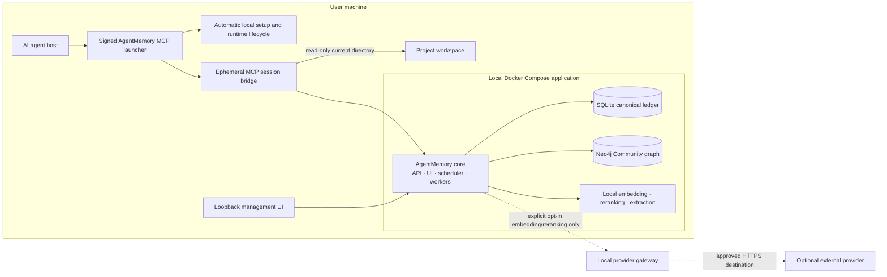

# AgentMemory

> Local-first, agent-neutral persistent memory and code intelligence for AI coding agents.

AgentMemory is a planned local, persistent, agent-neutral “brain” for AI coding agents.
It is designed to preserve useful context across sessions, repositories, directories, and
agent vendors while keeping the Brain and its data on the user's own machine.

> [!IMPORTANT]
> AgentMemory is in **early production implementation**. PF-001 now has a substantial,
> fail-closed installer control plane—including the default verified first-start composition,
> durable active cancellation with ownership-scoped runtime compensation, split capacity policy,
> operation-scoped release-bound Docker/Compose execution, native package transactions, and a
> portable MCP bootstrap plus deterministic Claude MCPB, Gemini extension, and generic host-package
> assemblers. No production-signed package has been released yet: external platform signing,
> immutable-release configuration, vendor approvals, and pristine-host certification remain. See the
> [PF-001 implementation record](docs/implementation/PF-001.md) for the exact delivered and
> outstanding scope; no current code should be interpreted as a completed installer.

The project is inspired by the persistent-memory experience of
[Claude-Mem](https://github.com/thedotmack/claude-mem), but its target is broader:
AgentMemory is not tied to Claude, Codex, Gemini, GLM, a particular IDE, or a particular
model provider.

## The problem

AI coding agents usually lose important knowledge when a session ends. Even when a tool
stores transcripts, the resulting history is commonly:

- isolated by agent vendor;
- scoped to one directory without understanding related repositories;
- difficult to search semantically;
- disconnected from the code that proves a claim;
- unaware that a decision or dependency has become stale;
- unable to distinguish a verified lesson from an unsupported model conclusion.

That makes every new session spend time reconstructing facts the user and their agents
already discovered.

AgentMemory is intended to turn those disconnected sessions and codebases into one
evidence-backed Brain. Each project remains an independently scoped subgraph, while
explicit relationships connect projects into the user's wider technical system.

For example, an agent should be able to answer:

- What did we do in the previous session, even if another agent performed the work?
- Why was this architecture decision made?
- Where is this behavior implemented?
- Which frontend consumes the User API?
- Which repositories publish or consume this event?
- What failed previously, what fixed it, and is that lesson applicable here?
- Which facts are current, disputed, stale, or historical?

Every answer should be scoped, concise, temporally correct, and traceable to evidence such
as a session, commit, file, symbol, command, test, document, or explicit user statement.

## Product principles

AgentMemory is specified around the following principles:

1. **Agent-neutral core** — agent-specific behavior ends at a versioned adapter boundary.
2. **One connected Brain** — projects are scoped subgraphs, not isolated databases.
3. **Evidence before assertion** — facts require provenance or must be labeled as inference.
4. **Path is location, not identity** — repositories, projects, checkouts, and directories
   receive stable identities that survive moves and worktrees.
5. **Local-only product** — the Brain, graph, indexes, UI, workers, audit history, and
   backups run on the user's machine.
6. **Provider independence** — embedding and reranking vendors are replaceable adapters.
7. **Temporal truth** — historical facts remain queryable without being presented as current.
8. **Progressive disclosure** — agents receive compact briefings first and expand into
   detailed evidence only when needed.
9. **Evidence-gated improvement** — failures may produce candidate lessons, but independent
   validation and policy govern promotion.
10. **No autonomous self-modification** — learned artifacts cannot silently rewrite prompts,
    permissions, policies, adapters, security controls, executable code, or model weights.

## Intended user experience

The product goal is that a user performs one installation action: install the AgentMemory
MCP integration in their AI agent.

The signed AgentMemory bootstrapper is specified to:

1. detect the operating system, architecture, resources, and any compatible local Docker
   installation;
2. securely download, verify, install, configure, and start Docker Desktop or Docker Engine
   plus Compose when they are absent;
3. handle WSL2 or rootless-Linux prerequisites, native privilege approval, and reboot resume;
4. download and verify the AgentMemory images and local model artifacts;
5. create local keys, networks, volumes, SQLite state, and the Neo4j graph;
6. configure the selected agent's MCP entry and supported lifecycle hooks without overwriting
   unrelated configuration;
7. run an end-to-end write, index, graph, embedding, and recall test before reporting Ready.

No supported installation path should require the user to know Docker, enter a Docker or
Compose command, edit configuration, select a Docker context, create a Docker account, or
manually start a service. The only unavoidable interactions are applicable third-party
terms, the operating system's privilege prompt, an approved restart, or administrator
approval on a managed device.

This zero-knowledge installer is a **specified product requirement**, not currently available
software.

## High-level architecture

### Local runtime topology

The specification defines one supported deployment model: a single-user, single-machine
Docker Compose installation.

| Component | Responsibility |
|---|---|
| Host bootstrapper/launcher | Installs and manages the local runtime, exposes bootstrap MCP status, starts the stack, and launches session bridges |
| Core | Owns the API, UI, scheduler, ingestion, indexing, retrieval, learning, audit, and local job roles |
| SQLite | Canonical event ledger, configuration, jobs, audit state, deletion guards, and rebuild inputs |
| Neo4j Community | Rebuildable temporal knowledge graph, full-text projection, and vector indexes |
| Local model services | Default offline embedding, reranking, and structured memory extraction |
| MCP session bridge | Short-lived container with a read-only mount of exactly the current directory |
| Provider gateway | Optional, explicitly enabled egress path for approved remote embedding or reranking calls |

The persistent core never receives a broad home-directory mount. Each agent session gets a
separate, short-lived bridge and credential. The bridge can read only the directory from
which that agent was started and cannot access the Docker socket, database credentials, or
unrelated project directories.

## How the Brain is organized

AgentMemory does not create one disconnected database per directory. A Brain contains
multiple scoped projects and repositories connected through evidence-backed relationships.

The conceptual graph includes node families such as:

- Brain, Project, Repository, Checkout, Branch, Commit, and FileRevision;
- Symbol, Package, API, Endpoint, Schema, Service, Event, and Dependency;
- Agent, Session, Task, Attempt, Outcome, Turn, and ToolEvent;
- Memory, Assertion, Evidence, Contradiction, Decision, and Procedure;
- ProviderProfile, EmbeddingSpace, IndexGeneration, and Evaluation;
- LearningCandidate, CausalHypothesis, Promotion, Deployment, and Rollback.

Relationships record facts such as:

- a frontend **CONSUMES** an API endpoint;
- a service **PUBLISHES** or **SUBSCRIBES_TO** an event;
- a symbol **IMPLEMENTS**, **CALLS**, or **DEPENDS_ON** another entity;
- a decision **AFFECTS** a project and is **SUPPORTED_BY** evidence;
- a memory **DERIVED_FROM** a session, task, file, or test;
- a lesson **APPLIES_TO** a bounded environment and **VALIDATED_BY** independent outcomes.

Assertions carry provenance, confidence, valid-time and transaction-time ranges, applicable
branch or commit, and dispute/supersession state. Neo4j is a rebuildable projection; raw
authorized events and artifacts remain canonical in the local ledger and encrypted artifact
store.

## Memory lifecycle

The planned memory system distinguishes several memory classes:

- **episodic** — what happened in a session or task;
- **semantic** — evidence-backed facts about the user's systems;
- **procedural** — verified ways of performing work or avoiding a recurring mistake;
- **decisions** — rationale, alternatives, scope, and consequences;
- **continuity** — unresolved work, checkpoints, blockers, and next steps;
- **preferences** — explicit user preferences with controlled scope.

Memory is extracted from authorized observable events, deduplicated, connected to evidence,
versioned, corrected, disputed, superseded, expired, archived, or deleted through explicit
lifecycle rules. Vectors are search projections, never the canonical copy of the content.

## Code and architecture intelligence

The indexer is intended to combine Tree-sitter, contract and configuration parsers, and
SCIP/LSP/compiler evidence where available. It will index:

- files, symbols, definitions, references, calls, inheritance, and implementations;
- OpenAPI, GraphQL, protobuf/gRPC, AsyncAPI, and JSON Schema contracts;
- packages, manifests, lockfiles, and dependency relationships;
- Docker, CI/CD, Terraform, Kubernetes, and deployment configuration found in user projects;
- API producers and consumers across repositories;
- message publishers, subscribers, schemas, and infrastructure topology;
- commit-aware revisions and stale or invalidated relationships.

Exact file and symbol evidence should allow an agent to navigate from an answer directly to
the code supporting it.

## Retrieval pipeline

Recall combines independent retrieval channels rather than relying on vector similarity
alone:

1. authorize the Brain, project, repository, classification, and temporal scope;
2. resolve the current directory, repository, branch, commit, agent, and task context;
3. retrieve exact identifiers and paths;
4. retrieve lexical/full-text candidates;
5. retrieve compatible semantic-vector candidates;
6. expand bounded graph relationships;
7. apply temporal and stale-fact rules;
8. fuse channels, optionally rerank, deduplicate, and enforce diversity;
9. return a compact briefing with citations, confidence, and degradation information;
10. abstain when the available evidence cannot support an answer.

## Embedding and reranking providers

AgentMemory is designed around a versioned provider-adapter protocol. Planned built-in
adapters include OpenAI, Cohere, Voyage, Google, Qwen-compatible, and OpenAI-compatible
endpoints. Users can add their own language-neutral provider sidecar by implementing the
published protocol and passing the conformance and security suite.

The default offline provider profile is specified to use pinned local models:

- Qwen3-Embedding-0.6B;
- Qwen3-Reranker-0.6B;
- Qwen3-4B-GGUF Q4_K_M for local structured extraction.

Provider, model revision, dimensions, preprocessing, tokenizer, normalization, instruction
profile, and quantization form an immutable embedding-space identity. Incompatible vectors
are never mixed in one index. Changing any identity component creates a new generation that
must be built, evaluated, and activated safely.

External provider access is disabled by default. When enabled, only approved embedding and
reranking operations can leave the machine through a constrained local gateway. Extraction
remains local, and restricted, local-only, private, or secret-bearing payloads are never
eligible for provider egress.

## Evidence-gated self-improvement

“Learning from mistakes” does not mean allowing an agent to rewrite itself.

The specified learning loop is:

1. define the task's observable success conditions;
2. record attempts and independently observable outcomes;
3. detect a possible mistake without treating every failure as agent fault;
4. create evidence-linked causal hypotheses;
5. compile a narrow, structured lesson or procedure candidate;
6. evaluate it against a baseline, counterexamples, unrelated tasks, and hidden holdouts;
7. require policy-based review or approval according to risk;
8. shadow or canary the procedure on compatible tasks;
9. measure exposure, application, outcome, efficacy, and negative transfer separately;
10. suspend and roll back automatically when verified adverse evidence appears.

A model cannot validate its own lesson through correlated restatements. High-risk procedures
require explicit approval, and learned content cannot change permissions, policies, prompts,
provider configuration, evaluators, executable adapters, security controls, or model weights.

## Security and privacy model

The specification treats local deployment as a security boundary, not as permission to run
everything with broad host access.

Key requirements include:

- loopback-only API and UI;
- private Docker networks and no direct Internet route for core services;
- no Docker socket inside AgentMemory containers;
- read-only, directory-scoped session mounts;
- non-root containers, dropped capabilities, read-only root filesystems, and bounded resources;
- signed, digest-pinned launchers, runtime installers, images, models, adapters, and manifests;
- local key generation, encrypted sensitive payloads, and protected secret references;
- provenance, authorization, and Brain filters before retrieval candidates are accessed;
- stored-prompt-injection defenses and untrusted-context labeling;
- immediate recall exclusion on deletion plus asynchronous purge and restore guards;
- tamper-evident audit checkpoints and signed encrypted local backups;
- no telemetry exporter or hosted AgentMemory control plane;
- no Docker Offload, remote daemon, or cloud execution for AgentMemory workloads.

The system does not claim protection from a fully compromised host, privileged host
administrator, compromised Docker daemon, or unlocked physical machine.

## Engineering requirements

This is intentionally specified as a complete production product rather than an MVP.
Implementation work may be sequenced, but a partial system is not a releasable AgentMemory
product.

The technical delivery contract requires:

- Clean Architecture and explicit dependency direction;
- domain-driven bounded contexts;
- SOLID principles and constructor dependency injection;
- aggregate-oriented repositories and explicit units of work;
- command/query separation and typed errors;
- KISS constraints against unnecessary frameworks and abstractions;
- mandatory Red-Green-Refactor TDD for every story and defect;
- at least 80% line and branch coverage globally and per Python/TypeScript package;
- at least 80% statement coverage per Go launcher package, decision-table tests, fuzzing,
  race detection, and mutation testing;
- strict typing and blocking Ruff, mypy, Import Linter, ESLint, TypeScript, formatting,
  security, contract, migration, and architecture checks;
- unit, property, contract, integration, end-to-end, security, privacy, migration,
  resilience, load, soak, backup/restore, and chaos testing;
- signed releases, SBOMs, provenance, immutable images, and rollback verification.

The delivery specification currently contains 99 required user stories. Every story includes
acceptance criteria, a normative technical approach, mandatory tests, and rationale.

## Documentation

| Document | Purpose |
|---|---|
| [Product Requirements Document](./PRD.md) | Product vision, behavior, graph and memory model, installation experience, security, quality gates, and product acceptance scenarios |
| [Technical Requirements and Delivery Specification](./TECHNICAL_REQUIREMENTS.md) | Required architecture, stack, persistence, contracts, security controls, engineering standards, CI/CD, implementation stories, and test obligations |
| [PF-001 implementation record](./docs/implementation/PF-001.md) | Exact delivered installer-foundation scope, automated evidence, known gaps, and next implementation order |
| [Custom agent registration contract](./docs/integrations/CUSTOM_AGENT_REGISTRATION.md) | Path-neutral MCP stdio contract and conformance obligations for hosts without a certified configuration adapter |

The two documents are jointly normative. The PRD defines what the complete product must do;
the technical specification defines how it must be implemented and proven.

## Current repository status

Present today:

- complete product requirements;
- normative production architecture and stack requirements, with ADR-001 through ADR-018
  accepted;
- local Docker deployment and zero-knowledge installation contract;
- graph, memory, indexing, retrieval, provider, and learning specifications;
- security, privacy, backup, upgrade, recovery, and supply-chain requirements;
- 99 implementation-ready user stories and their acceptance/test contracts;
- the unreleasable PF-001 control-plane increments: the resumable installation saga,
  authenticated operation/cancellation journals and rollback anchors, signed runtime/release
  catalogs, resumable artifact acquisition and per-purpose capacity state, release-bound direct
  Docker/Compose execution policy, Docker resource policy, readiness and activation gates,
  protected Linux/macOS/Windows configuration stores, native package installer/postconditions,
  live portable-to-installed MCP handoff, deterministic host packages, sealed qualification and
  copy-only promotion workflows, and strict quality tooling.

Not present yet:

- a production-signed end-user release (the runnable local Core and installer composition exist,
  but no qualified artifact set has been minted);
- signed production Docker images, model files, Compose bundles, schemas, migrations, SBOMs,
  provenance, or release catalogs;
- platform signing/notarization identities, vendor redistribution approvals, or the full
  PF-001 pristine-host, offline, interruption, packet-capture, usability, and certified-host
  acceptance evidence;
- a published, production-signed MCPB/Gemini/generic package (the verified builders exist);
- published releases or support guarantees.

## Contributing

The project is currently establishing its implementation foundation. Before proposing code,
read both normative documents and ensure the change preserves the stated architecture,
security invariants, TDD workflow, and complete-product scope.

Contribution workflow, governance, issue templates, code of conduct, and release procedures
will be added with the implementation repository structure.

## License

No open-source license has been selected yet. Until a license file is added, copyright law
applies by default and no permission is granted to copy, modify, or redistribute this work.
