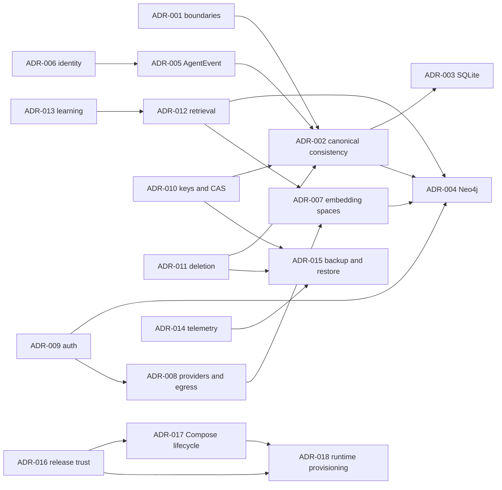

# AgentMemory Architecture Decision Records

This directory is the accepted architecture baseline required by
[TECHNICAL_REQUIREMENTS.md Section 13](../../TECHNICAL_REQUIREMENTS.md#13-required-adrs-before-implementation-begins).
The ADRs record implementation choices within the PRD and technical specification; they do not waive
or reopen required product scope.

## Decision precedence

When a decision appears to compete with another requirement, implementations apply this order:

1. Brain isolation, local-principal authorization, deletion, privacy, and controlled-learning safety.
2. Durability, correctness, provenance, temporal truth, and auditability.
3. Public compatibility and operability.
4. Latency and throughput objectives.
5. Developer convenience.

The PRD and technical requirements remain normative. An ADR may select an allowed implementation or
make a `SHOULD` exception with approval; it cannot weaken a `MUST`. Changing a `MUST` requires an
approved specification change and the corresponding ADR update.

## Accepted decisions

| ADR | Decision | Primary owner(s) |
|---|---|---|
| [ADR-001](ADR-001-clean-architecture-and-bounded-contexts.md) | Clean Architecture, bounded contexts, and import contracts | Architecture; Engineering Quality |
| [ADR-002](ADR-002-canonical-sql-and-neo4j-projection-consistency.md) | Canonical SQL state, Neo4j projection ownership, and outbox consistency | Data Architecture; Ingestion |
| [ADR-003](ADR-003-sqlite-durability-concurrency-and-backup.md) | Packaged SQLite durability, writer ownership, jobs, and online backup | Data Persistence; Operations |
| [ADR-004](ADR-004-neo4j-community-scope-and-vector-authorization.md) | Neo4j Community cadence, multi-Brain scope, and vector authorization | Graph; Security |
| [ADR-005](ADR-005-agentevent-versioning-idempotency-and-ordering.md) | AgentEvent versioning, idempotency, and ordering | Ingestion; Agent Adapters |
| [ADR-006](ADR-006-project-repository-checkout-and-device-identity.md) | Project, repository, checkout, and device identity fingerprints | Identity; Security |
| [ADR-007](ADR-007-embedding-space-fingerprint-and-index-migration.md) | Embedding-space fingerprint, index names, and migration | Providers; Retrieval |
| [ADR-008](ADR-008-provider-sidecar-protocol-trust-and-egress.md) | Provider sidecar protocol, trust, sandbox, and gateway-only egress | Providers; Security |
| [ADR-009](ADR-009-local-identity-authorization-and-loopback-controls.md) | Local identity, authorization, and loopback/browser controls | Governance; Security |
| [ADR-010](ADR-010-encryption-key-management-cas-and-secrets.md) | Encryption envelope, key management, CAS, disk encryption, and secrets | Security; Data Protection |
| [ADR-011](ADR-011-deletion-dependency-manifest-and-restore-guard.md) | Deletion manifests, tombstones, restore guards, and provider deletion | Governance; Data Protection |
| [ADR-012](ADR-012-retrieval-fusion-budgets-and-explanation.md) | Retrieval fusion, graph/context budgets, and explanation traces | Retrieval; Product Intelligence |
| [ADR-013](ADR-013-evidence-gated-learning-promotion-and-rollback.md) | Evidence-gated learning, evaluator isolation, promotion, canary, and rollback | Learning; Security |
| [ADR-014](ADR-014-local-opentelemetry-privacy-retention-and-regression.md) | Local OpenTelemetry privacy, retention, and regression calculations | Observability; Security |
| [ADR-015](ADR-015-encrypted-backup-isolated-restore-and-activation.md) | Encrypted backup, deletion continuity, isolated restore, and activation | Operations; Data Protection |
| [ADR-016](ADR-016-release-signing-sbom-provenance-and-version-policy.md) | Release signing, SBOM/provenance, supported versions, and dependency updates | Security; Release Engineering |
| [ADR-017](ADR-017-compose-topology-launcher-session-and-resource-lifecycle.md) | Compose topology, launcher sessions, resource generations, and uninstall | Architecture; Runtime/Installer |
| [ADR-018](ADR-018-automatic-container-runtime-provisioning.md) | Automatic Docker Desktop/Engine provisioning and ownership lifecycle | Runtime/Installer; Security |

All 18 decisions have status `Accepted`, decision owner(s), decision date, and a first scheduled review
date. No required decision remains intentionally open.

## How the decisions fit together

## PF-001 implementation gate

PF-001 directly depends on:

- ADR-001 for launcher layers, capability ports, and composition;
- ADR-009/ADR-010 for owner, installation/session credentials, key material, and loopback setup;
- ADR-014 for content-safe local setup/operation evidence;
- ADR-015 for recovery-point verification used by upgrades and destructive recovery;
- ADR-016 for the canonical release/runtime manifest and verification chain;
- ADR-017 for exact Compose services/resources, startup lock, generations, and scoped uninstall; and
- ADR-018 for the fourteen top-level installer phases, nested PF-006 runtime saga, privilege, consent,
  reboot, ownership, repair, and separate runtime removal.

The other decisions define the Brain readiness smoke test and durable product that PF-001 must start.
PF-001 cannot report Ready by substituting fake adapters or by passing container-running checks alone.

## ADR change procedure

1. Open a specification change if a normative `MUST` would change.
2. Update the affected ADR with context/evidence, exact old/new decision, security/privacy impact,
   compatibility/migration/rollback, rejected alternatives, consequences, verification, owner, and
   next review date.
3. Update dependent ADR links and implementation/contract schemas in the same pull request.
4. Run architecture, contract, migration, security, privacy, resilience, performance, and release
   qualification affected by the decision.
5. Obtain named owner and CODEOWNER approval. A superseded ADR remains in history and links its
   successor; accepted release artifacts retain the ADR/version set that governed them.
